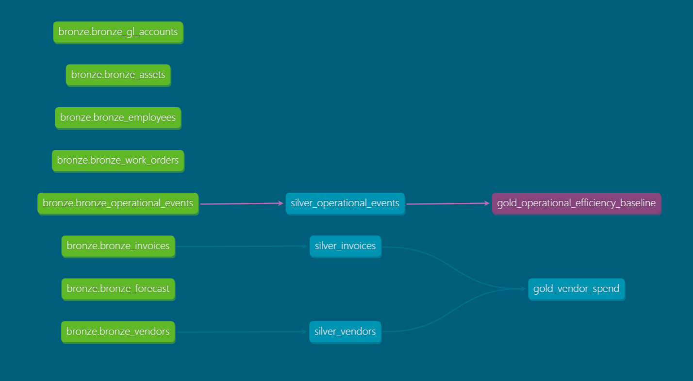
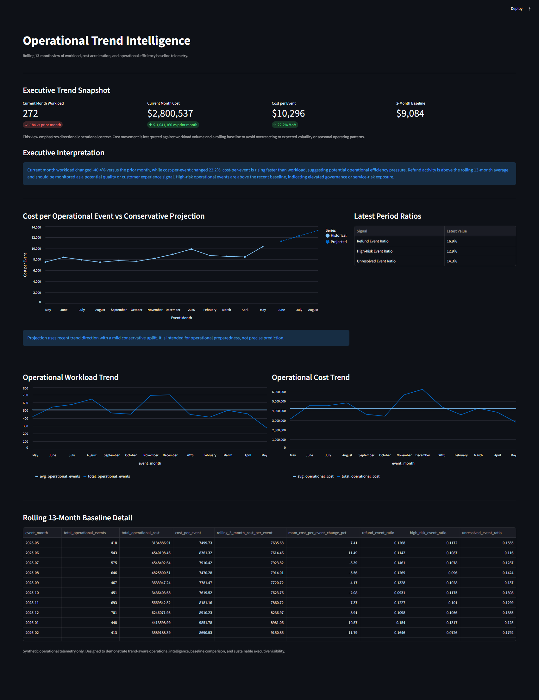
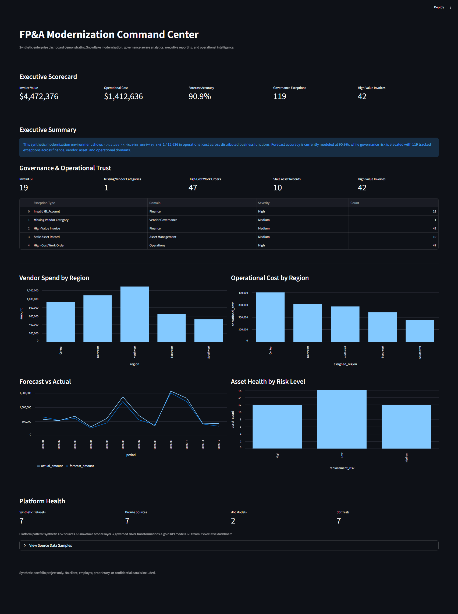

# FP&A Modernization Lab

## Executive Summary
FP&A Modernization Lab is a modernization-focused analytics platform designed to demonstrate how governed data infrastructure, operational telemetry, and sustainable delivery practices enable scalable enterprise decision support.

The platform combines Snowflake, dbt, Streamlit, Docker, and CI validation workflows to simulate a modern operational intelligence environment capable of supporting executive visibility, trend-aware telemetry, and trustworthy analytics transformation.

Rather than focusing solely on reporting, the platform emphasizes operational sustainability, governance-aware architecture, explainable transformation flow, and baseline-driven decision support designed to help organizations scale responsibly in an increasingly accelerated AI and analytics landscape.

## Modernization Philosophy
Modern enterprise modernization is increasingly pressured by the demand for accelerated AI adoption, rapid delivery cycles, and continuously evolving analytics tooling. However, organizations that prioritize delivery speed without reinforcing foundational infrastructure often create compounding operational and technical debt that eventually erodes trust in both systems and data.

This platform was intentionally designed around the belief that sustainable modernization depends on:

- trustworthy data foundations
- governed transformation layers
- operational observability
- reproducible infrastructure
- explainable lineage
- and baseline-aware decision support

The goal is not simply to move faster, but to build operational systems capable of sustaining accelerated change without sacrificing governance, interpretability, or long-term maintainability.

The platform demonstrates how operational telemetry, governance-aware analytics engineering, and modern data tooling can work together to create scalable executive visibility while preserving operational trust.

## Core Principles
The platform was intentionally built around several core modernization principles designed to reinforce sustainable operational scaling and trustworthy analytics delivery.

- **Baseline Before Anomaly**  
Operational intelligence is only meaningful when systems establish trustworthy historical baselines capable of supporting contextual interpretation and root-cause analysis.

- **Governance As An Operational Enabler**  
  Governance is treated as a visibility and sustainability mechanism rather than a delivery obstacle. Validation, lineage, and operational telemetry help preserve trust as systems evolve.

- **Sustainable Velocity Over Short-Term Acceleration**  
  Rapid delivery without foundational stability often creates compounding technical and operational debt. The platform prioritizes scalable infrastructure capable of sustaining accelerated change responsibly.

- **Explainability And Traceability**  
  Transformation layers, operational telemetry, and executive metrics are intentionally designed to remain interpretable and traceable across Bronze → Silver → Gold workflows.

- **Operational Context Over Dashboard Noise**  
  The platform emphasizes directional visibility, workload-aware telemetry, and executive interpretability over reactive alert saturation or overly aggressive automation behavior.

- **Reproducibility And Portability**  
  Containerization, CI validation, and structured transformation workflows reinforce repeatable operational behavior and sustainable deployment practices.

## Platform Architecture
The platform follows a layered Bronze → Silver → Gold architecture pattern designed to reinforce governance, explainability, and trusted operational transformation flow.

- **Bronze** captures raw operational and financial telemetry.
- **Silver** applies standardization, validation, governance logic, and business-safe transformation layers.
- **Gold** surfaces executive-ready operational intelligence, baseline-aware metrics, and trend-focused decision support.

This layered approach enables reproducible analytics engineering workflows while preserving operational trust and transformation traceability.



## Operational Intelligence
The platform includes operational telemetry and trend intelligence capabilities designed to provide directional operational awareness rather than noisy alert-driven reporting.

Operational metrics are normalized against rolling baselines to support:

- workload-aware operational visibility
- cost-per-event efficiency tracking
- governance risk monitoring
- operational trend analysis
- and conservative forward-looking planning support

The operational intelligence layer emphasizes interpretability and sustainable executive visibility over reactive dashboard noise.



## Governance & Trust
The platform was intentionally designed around the idea that operational velocity without governance eventually degrades trust in both systems and decision-making.

Governance within the platform is treated as an operational enabler rather than a delivery obstacle. The architecture emphasizes:

- transformation traceability
- data quality validation
- governed lineage visibility
- operational risk telemetry
- and reproducible deployment behavior

dbt validation layers, operational baseline modeling, and governance-aware telemetry help surface operational drift and directional instability before they evolve into larger systemic failures.

Rather than relying on reactive alerting alone, the platform focuses on establishing trustworthy operational baselines capable of supporting proactive decision-making and sustainable modernization practices.

## dbt Transformation & Lineage
dbt was incorporated into the platform to reinforce governed analytics engineering workflows, explainable transformation layers, and operational lineage visibility.

The dbt implementation demonstrates how modern transformation tooling can help organizations improve:

- transformation traceability
- model dependency visibility
- operational explainability
- validation-driven development
- and governed analytics delivery

The platform uses layered Bronze → Silver → Gold modeling patterns to separate:

- raw telemetry ingestion
- business-safe transformation logic
- and executive operational intelligence outputs

dbt testing and lineage capabilities help surface transformation issues early while supporting reproducible operational workflows and trusted decision-support telemetry.


## Streamlit Applications

The platform includes multiple Streamlit applications designed to simulate executive operational visibility and modern analytics decision-support workflows.

---
### Executive Command Center
---

The Executive Command Center focuses on high-level KPI visibility, governance-aware reporting, and operational summary metrics intended to support leadership-level decision awareness.

<p align="center">
  
</p>

---
### Operational Trend Intelligence
---

The Operational Trend Intelligence application focuses on trend-aware operational telemetry, workload visibility, rolling efficiency baselines, and conservative forward-looking operational projections.

The application intentionally emphasizes interpretability and executive context over noisy alerting behavior.

Key operational intelligence capabilities include:

- rolling 13-month workload visibility
- operational cost trend analysis
- cost-per-event baseline tracking
- governance risk ratio monitoring
- conservative trend-following projections
- and executive narrative interpretation

<p align="center">
  
</p>

## Docker & Reproducibility
The platform includes containerized deployment support to reinforce reproducibility, portability, and environment consistency across development workflows.

Dockerization was intentionally included to demonstrate how modern analytics platforms can reduce environmental drift while supporting scalable operational deployment patterns.

Containerized execution also reinforces several core modernization principles emphasized throughout the platform:

- reproducible infrastructure behavior
- reduced operational inconsistency
- portable analytics deployment
- simplified onboarding
- and sustainable environment management

The goal is not simply deployment convenience, but operational consistency capable of supporting long-term scalability and maintainability.

## CI/CD & Validation
The platform includes CI validation workflows designed to reinforce governed delivery and sustainable analytics engineering practices.

Validation workflows help ensure that transformation logic, model dependencies, and operational telemetry layers remain stable as the platform evolves.

Current validation capabilities include:

- dbt model testing
- transformation validation
- schema consistency checks
- reproducible execution workflows
- and controlled deployment behavior

The CI layer reinforces the broader modernization principle that sustainable operational velocity depends on trustworthy validation and controlled change management rather than unmanaged acceleration alone.

## Repository Structure
```text
fpna-modernization-lab/
├── assets/                     # README visuals and architecture screenshots
├── data/
│   ├── synthetic/             # Generated operational and financial telemetry
│   └── generate_*.py          # Synthetic data generators
├── dbt/                       # dbt transformation project
│   ├── models/
│   │   ├── bronze/
│   │   ├── silver/
│   │   └── gold/
│   └── target/                # Generated dbt artifacts and lineage
├── sql/                       # Snowflake ingestion and setup scripts
├── streamlit/                 # Executive-facing operational intelligence apps
├── .github/workflows/         # CI validation workflows
├── docker-compose.yml         # Containerized deployment configuration
├── Dockerfile                 # Reproducible application environment
└── README.md
```

## Future Roadmap
Planned future enhancements focus on extending operational intelligence, governance-aware observability, and scalable executive decision-support capabilities.

Potential roadmap areas include:

- expanded operational telemetry models
- anomaly and variance detection
- advanced workload forecasting
- governance drift monitoring
- KPI lineage expansion
- role-aware executive dashboards
- orchestration workflow integration
- and additional operational intelligence simulations

The long-term goal is to continue evolving the platform into a governed operational intelligence environment capable of demonstrating sustainable enterprise modernization patterns rather than isolated analytics tooling alone.

## Key Takeaways
This platform was intentionally designed to demonstrate that sustainable modernization depends on more than rapid tooling adoption alone.

The project emphasizes how governed architecture, operational telemetry, explainable transformation flow, and trustworthy baseline-aware analytics can help organizations scale responsibly in increasingly accelerated data and AI environments.

Key themes demonstrated throughout the platform include:

- sustainable operational velocity
- governance-aware modernization
- trusted transformation architecture
- operational observability
- reproducible analytics infrastructure
- executive-aligned decision support
- and interpretable operational intelligence

Rather than positioning AI and analytics acceleration as a replacement for foundational engineering discipline, the platform reinforces the idea that long-term modernization success depends on strengthening the systems capable of sustaining accelerated change itself.