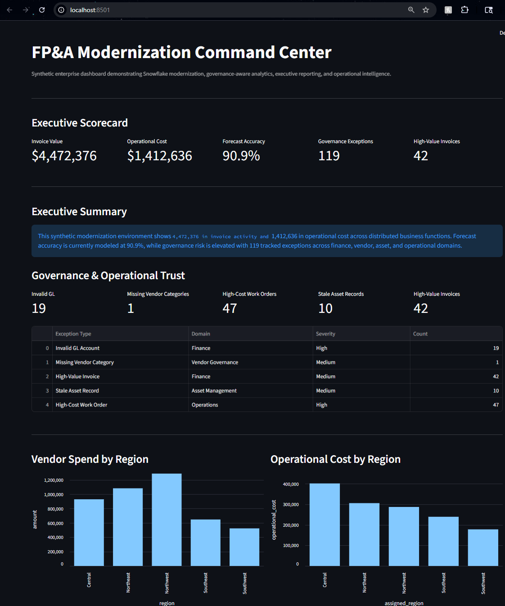
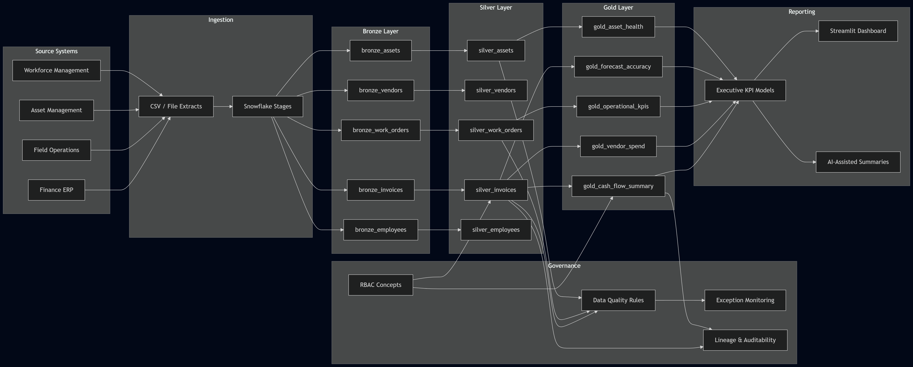

# FP&A Modernization Lab

Synthetic enterprise modernization platform demonstrating Snowflake medallion architecture, governance-aware analytics engineering, executive reporting, and AI-assisted operational intelligence concepts.

---

# Executive Dashboard

<p align="center">
  
</p>

---

# Architecture Overview

<p align="center">
  
</p>

---

# Executive Summary

The FP&A Modernization Lab simulates how a mid-market infrastructure services organization can modernize fragmented finance and operations reporting into a governed analytics platform.

The project demonstrates:

- Snowflake medallion architecture
- governance-aware transformation design
- executive KPI reporting
- operational intelligence concepts
- data quality monitoring
- AI-ready analytics workflows
- architecture-first modernization strategy

The portfolio intentionally uses synthetic data only.

---

# Business Scenario

The synthetic organization models common enterprise modernization challenges including:

- spreadsheet-driven finance workflows
- fragmented operational reporting
- inconsistent vendor governance
- delayed executive visibility
- inconsistent KPI definitions
- stale operational data
- manual reconciliation processes

The architecture demonstrates how governed analytics platforms improve operational trust and executive decision-making.

---

# Platform Capabilities

| Capability | Description |
|---|---|
| Bronze Layer | Raw ingestion preserving source fidelity |
| Silver Layer | Governed business entity standardization |
| Gold Layer | Executive KPI and analytics models |
| Governance Monitoring | Centralized DQ and exception visibility |
| Executive Reporting | KPI scorecards and operational dashboards |
| AI-Ready Architecture | Human-in-the-loop analytics concepts |

---

# Technical Stack

| Area | Technology |
|---|---|
| Cloud Data Platform | Snowflake |
| Dashboarding | Streamlit |
| Programming | Python |
| Transformation | SQL |
| Architecture Visualization | Mermaid.js |
| Documentation | Markdown |
| Version Control | GitHub |

---

# Medallion Architecture

The project implements a medallion architecture pattern:

| Layer | Purpose |
|---|---|
| Bronze | Raw source ingestion |
| Silver | Standardization and governance |
| Gold | Business-ready analytics |

This separation improves:

- governance
- auditability
- lineage visibility
- operational trust
- reporting consistency

---

# Governance Concepts

The modernization lab demonstrates governance-aware analytics concepts including:

- data quality validation
- governance exception monitoring
- standardized KPI logic
- RBAC concepts
- operational trust indicators
- lineage-aware transformation flow

---

# Example KPI Models

The gold layer includes:

- cash flow visibility
- vendor spend analytics
- operational KPI scorecards
- forecast variance reporting
- asset health monitoring
- governance exception visibility

---

# Repository Structure

```text
fpna-modernization-lab/
├── assets/
├── data/
├── diagrams/
├── docs/
├── sql/
└── streamlit/
```

---

# Future Enhancements

Planned future enhancements include:

- dbt transformation framework
- Dockerized local development
- Snowpipe ingestion concepts
- AI-assisted executive summaries
- semantic business models
- governance scorecards
- metadata-driven orchestration

---

# Key Skills Demonstrated

- Snowflake architecture
- Analytics engineering
- Governance-aware design
- Executive reporting
- Operational intelligence
- Data quality monitoring
- Technical documentation
- Architecture communication
- AI modernization strategy

---

# Disclaimer

This project uses synthetic data only.

No client, employer, proprietary, or confidential information is included.
