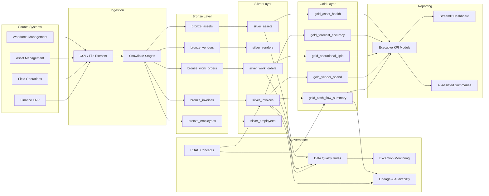

# FP&A Modernization Architecture

```mermaid
flowchart LR

    subgraph Source Systems
        ERP[Finance ERP]
        OPS[Field Operations]
        ASSET[Asset Management]
        WFM[Workforce Management]
    end

    subgraph Ingestion
        FILES[CSV / File Extracts]
        STAGE[Snowflake Stages]
    end

    subgraph Bronze Layer
        B_INV[bronze_invoices]
        B_VEND[bronze_vendors]
        B_WO[bronze_work_orders]
        B_ASSET[bronze_assets]
        B_EMP[bronze_employees]
    end

    subgraph Silver Layer
        S_INV[silver_invoices]
        S_VEND[silver_vendors]
        S_WO[silver_work_orders]
        S_ASSET[silver_assets]
        S_EMP[silver_employees]
    end

    subgraph Gold Layer
        G_CF[gold_cash_flow_summary]
        G_SPEND[gold_vendor_spend]
        G_KPI[gold_operational_kpis]
        G_FORECAST[gold_forecast_accuracy]
        G_HEALTH[gold_asset_health]
    end

    subgraph Governance
        DQ[Data Quality Rules]
        RBAC[RBAC Concepts]
        EXCEPT[Exception Monitoring]
        LINEAGE[Lineage & Auditability]
    end

    subgraph Reporting
        KPI[Executive KPI Models]
        STREAMLIT[Streamlit Dashboard]
        AI[AI-Assisted Summaries]
    end

    ERP --> FILES
    OPS --> FILES
    ASSET --> FILES
    WFM --> FILES

    FILES --> STAGE

    STAGE --> B_INV
    STAGE --> B_VEND
    STAGE --> B_WO
    STAGE --> B_ASSET
    STAGE --> B_EMP

    B_INV --> S_INV
    B_VEND --> S_VEND
    B_WO --> S_WO
    B_ASSET --> S_ASSET
    B_EMP --> S_EMP

    S_INV --> G_CF
    S_INV --> G_SPEND
    S_WO --> G_KPI
    S_INV --> G_FORECAST
    S_ASSET --> G_HEALTH

    S_INV --> DQ
    S_WO --> DQ
    S_ASSET --> DQ

    RBAC --> S_INV
    RBAC --> G_CF

    DQ --> EXCEPT

    S_INV --> LINEAGE
    G_CF --> LINEAGE

    G_CF --> KPI
    G_SPEND --> KPI
    G_KPI --> KPI
    G_FORECAST --> KPI
    G_HEALTH --> KPI

    KPI --> STREAMLIT
    KPI --> AI
```